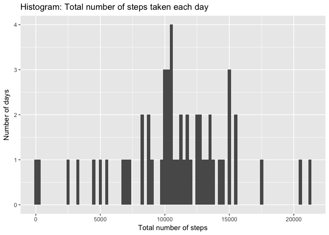
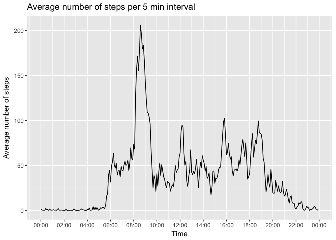
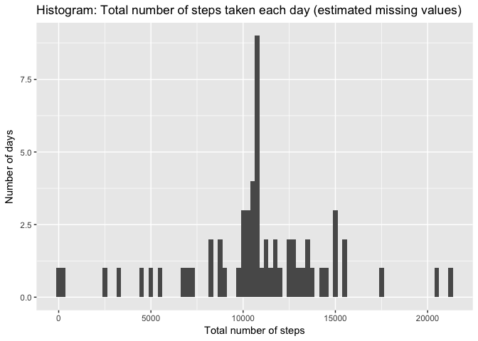
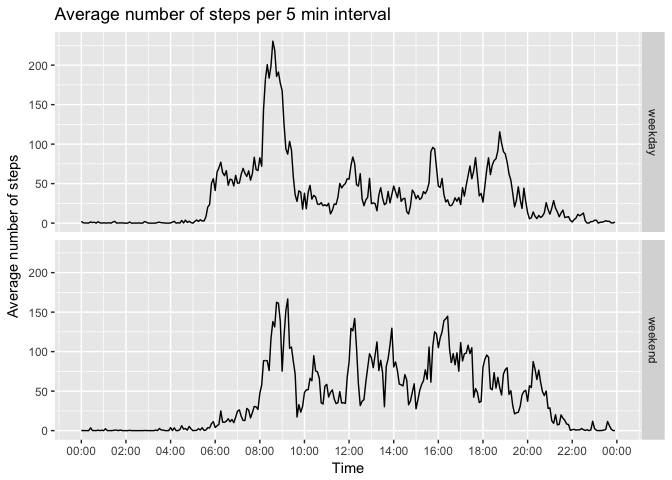

This is the Course Project 1 of the Reproducable Research course on Coursera.

## Loading and preprocessing the data

Load data into data frame.

```r
library(tidyverse)
```

```
## ── Attaching packages ─────────────────────────────────────── tidyverse 1.2.1 ──
```

```
## ✔ ggplot2 2.2.1     ✔ purrr   0.2.4
## ✔ tibble  1.3.4     ✔ dplyr   0.7.4
## ✔ tidyr   0.7.2     ✔ stringr 1.2.0
## ✔ readr   1.1.1     ✔ forcats 0.2.0
```

```
## ── Conflicts ────────────────────────────────────────── tidyverse_conflicts() ──
## ✖ dplyr::filter() masks stats::filter()
## ✖ dplyr::lag()    masks stats::lag()
```

```r
raw_df <- read_csv("activity.csv",
                   na = "NA",
                   col_types = cols(col_integer(),
                                    col_date(),
                                    col_integer()))
head(raw_df)
```

```
## # A tibble: 6 x 3
##   steps       date interval
##   <int>     <date>    <int>
## 1    NA 2012-10-01        0
## 2    NA 2012-10-01        5
## 3    NA 2012-10-01       10
## 4    NA 2012-10-01       15
## 5    NA 2012-10-01       20
## 6    NA 2012-10-01       25
```

Preprocessing of the data. The date and interval column are combined into a single datetime column of the POSIXct format.

```r
library(lubridate)
```

```
## 
## Attaching package: 'lubridate'
```

```
## The following object is masked from 'package:base':
## 
##     date
```

```r
df <-  raw_df %>% 
    mutate(hour = interval %/% 100, minute = interval %% 100 ) %>%
    mutate(datetime = ymd_hm(paste(date, hour, minute))) %>%
    select(steps, datetime, date, interval)

head(df)
```

```
## # A tibble: 6 x 4
##   steps            datetime       date interval
##   <int>              <dttm>     <date>    <int>
## 1    NA 2012-10-01 00:00:00 2012-10-01        0
## 2    NA 2012-10-01 00:05:00 2012-10-01        5
## 3    NA 2012-10-01 00:10:00 2012-10-01       10
## 4    NA 2012-10-01 00:15:00 2012-10-01       15
## 5    NA 2012-10-01 00:20:00 2012-10-01       20
## 6    NA 2012-10-01 00:25:00 2012-10-01       25
```


## What is mean total number of steps taken per day?
For this part of the assignment, you can ignore the missing values in the dataset.

1. Calculate the total number of steps taken per day

```r
df_per_day <- df %>% 
    drop_na() %>%
    group_by(date) %>%
    summarise(mean_steps = mean(steps), 
              total_steps = sum(steps))

head(df_per_day)
```

```
## # A tibble: 6 x 3
##         date mean_steps total_steps
##       <date>      <dbl>       <int>
## 1 2012-10-02    0.43750         126
## 2 2012-10-03   39.41667       11352
## 3 2012-10-04   42.06944       12116
## 4 2012-10-05   46.15972       13294
## 5 2012-10-06   53.54167       15420
## 6 2012-10-07   38.24653       11015
```

2. Make a histogram of the total number of steps taken each day

```r
ggplot(data = df_per_day, aes(total_steps)) + 
    geom_histogram(na.rm = TRUE, binwidth = 250) + 
    labs(title = "Histogram: Total number of steps taken each day",
         x = "Total number of steps",
         y = "Number of days")
```

<!-- -->

3. Calculate and report the mean and median of the total number of steps taken per day

```r
df_summary <- summary(df_per_day$total_steps, na.rm = TRUE)
df_summary
```

```
##    Min. 1st Qu.  Median    Mean 3rd Qu.    Max. 
##      41    8841   10765   10766   13294   21194
```
The mean is : 1.0766189\times 10^{4}  
The median is: 1.0765\times 10^{4} 

## What is the average daily activity pattern?

1. Make a time series plot (i.e. type = "1") of the 5-minute interval (x-axis) and the average number of steps taken, averaged across all days (y-axis)

```r
# The interval variable is tricky because there is a jump/gap between 55 and 100, etc.
# I can't find an object that can hold only time, all there is are date-times.
# My solution is to aggregate the same intervals into a single day.
# (Doesn't matter which day, here I use 01.01.2018.)
# If you know of a better solution please let me know :)
df_per_period <- df %>% 
    drop_na() %>%
    mutate(period = ymd_hm(paste(2018, 1, 1, interval %/% 100, minute = interval %% 100))) %>% 
    group_by(period) %>%
    summarise(mean_steps = mean(steps)) 

ggplot(df_per_period, aes(period, mean_steps)) + 
    geom_line() + 
    scale_x_datetime(date_labels = "%H:%M",
                     date_breaks = "2 hours") + 
    labs(title = "Average number of steps per 5 min interval",
         x = "Time",
         y = "Average number of steps")
```

<!-- -->

2. Which 5-minute interval, on average across all the days in the dataset, contains the maximum number of steps?

```r
filter(df_per_period, mean_steps == max(mean_steps))
```

```
## # A tibble: 1 x 2
##                period mean_steps
##                <dttm>      <dbl>
## 1 2018-01-01 08:35:00   206.1698
```
On average the most steps have been taken between 8:35 and 8:40.

## Imputing missing values

Note that there are a number of days/intervals where there are missing values (coded as *NA*). The presence of missing days may introduce bias into some calculations or summaries of the data.

 1. Calculate and report the total number of missing values in the dataset (i.e. the total number of rows with *NA*s)

```r
NA_in_df <- filter(df, is.na(steps) | is.na(date) | is.na(interval)) %>%
    summarise(n())

NA_in_steps <- summarise(df, sum(is.na(steps)))
NA_in_date <- summarise(df, sum(is.na(date)))
NA_in_interval <- summarise(df, sum(is.na(interval)))
```
Overall there are 2304 rows with missing values in the data. There are 2304 missing values in the *steps* column, 0 missing values in the *date* column and 0 missing values in the *interval* column.

 2. Devise a strategy for filling in all of the missing values in the dataset. The strategy does not need to be sophisticated. For example, you could use the mean/median for that day, or the mean for that 5-minute interval, etc.

I am using the mean of the 5-minute interval to estimate the missing values for the number of steps in an interval.

### 3. Create a new dataset that is equal to the original dataset but with the missing data filled in.

**Option 1:**

```r
# This works but is quite slow.
# If you are reviewing you can jump straight to Option 2.

df_per_interval <- df %>%
    group_by(interval) %>%
    summarise(mean_steps = mean(steps, na.rm = TRUE)) 

# Gets the mean value of a given interval from the df_per_interval data frame.
# The interval is given as integer.
mean_of_interval <- function(x) {
    row <- filter(df_per_interval, interval == x)
    if (nrow(row) == 0) {
        return(NA)
    }
    else {
        return(row[[2]])
    }
}

df_estimated_NAs <- df

for (ii in 1:nrow(df_estimated_NAs)) {
    if (is.na(df_estimated_NAs[ii, 1])) {
        df_estimated_NAs[ii, 1] <- mean_of_interval(df_estimated_NAs[[ii, 4]])
    }
}

df_estimated_NAs[1:5, ]
```

```
## # A tibble: 5 x 4
##       steps            datetime       date interval
##       <dbl>              <dttm>     <date>    <int>
## 1 1.7169811 2012-10-01 00:00:00 2012-10-01        0
## 2 0.3396226 2012-10-01 00:05:00 2012-10-01        5
## 3 0.1320755 2012-10-01 00:10:00 2012-10-01       10
## 4 0.1509434 2012-10-01 00:15:00 2012-10-01       15
## 5 0.0754717 2012-10-01 00:20:00 2012-10-01       20
```

```r
df_estimated_NAs[1001:1005, ]
```

```
## # A tibble: 5 x 4
##   steps            datetime       date interval
##   <dbl>              <dttm>     <date>    <int>
## 1     0 2012-10-04 11:20:00 2012-10-04     1120
## 2   180 2012-10-04 11:25:00 2012-10-04     1125
## 3    21 2012-10-04 11:30:00 2012-10-04     1130
## 4     0 2012-10-04 11:35:00 2012-10-04     1135
## 5     0 2012-10-04 11:40:00 2012-10-04     1140
```

**Option 2:**

```r
# much much faster
df_estimated_NAs <- df %>%
    group_by(interval) %>%
    mutate(mean = mean(steps, na.rm=TRUE)) %>% 
    mutate(steps = if_else(is.na(steps), mean, as.double(steps))) %>%
    select(-mean)

df_estimated_NAs[1:5, ]
```

```
## # A tibble: 5 x 4
## # Groups:   interval [5]
##       steps            datetime       date interval
##       <dbl>              <dttm>     <date>    <int>
## 1 1.7169811 2012-10-01 00:00:00 2012-10-01        0
## 2 0.3396226 2012-10-01 00:05:00 2012-10-01        5
## 3 0.1320755 2012-10-01 00:10:00 2012-10-01       10
## 4 0.1509434 2012-10-01 00:15:00 2012-10-01       15
## 5 0.0754717 2012-10-01 00:20:00 2012-10-01       20
```

```r
df_estimated_NAs[1001:1005, ]
```

```
## # A tibble: 5 x 4
## # Groups:   interval [5]
##   steps            datetime       date interval
##   <dbl>              <dttm>     <date>    <int>
## 1     0 2012-10-04 11:20:00 2012-10-04     1120
## 2   180 2012-10-04 11:25:00 2012-10-04     1125
## 3    21 2012-10-04 11:30:00 2012-10-04     1130
## 4     0 2012-10-04 11:35:00 2012-10-04     1135
## 5     0 2012-10-04 11:40:00 2012-10-04     1140
```
Conclusion: Don't use for loops in R, they are slow.


4. Make a histogram of the total number of steps taken each day and Calculate and report the mean and median total number of steps taken per day. Do these values differ from the estimates from the first part of the assignment? What is the impact of imputing missing data on the estimates of the total daily number of steps?

```r
df_estimated_NAs %>%
    group_by(date) %>%
    summarise(mean_steps = mean(steps), 
              total_steps = sum(steps)) %>%
    ggplot(aes(total_steps)) + 
        geom_histogram(na.rm = TRUE, binwidth = 250) + 
        labs(title = "Histogram: Total number of steps taken each day (estimated missing values)",
             x = "Total number of steps",
             y = "Number of days")
```

<!-- -->

If there are missing values they seem to be missing for the whole day, hence the number of days where the average number of steps is equal to the total average increases. That explains the spike around 11000 steps. 


```r
df2 <- df_estimated_NAs %>%
    group_by(date) %>%
    summarise(mean_steps = mean(steps), 
              total_steps = sum(steps))

summary(df2$total_steps)
```

```
##    Min. 1st Qu.  Median    Mean 3rd Qu.    Max. 
##      41    9819   10766   10766   12811   21194
```
Mean and median have not changed significantly.

## Are there differences in activity patterns between weekdays and weekends?

For this part the **weekdays()** function may be of some help here. Use the dataset with the filled-in missing values for this part.

1. Create a new factor variable in the dataset with two levels – “weekday” and “weekend” indicating whether a given date is a weekday or weekend day.

```r
df2 <- df_estimated_NAs %>%
    mutate(weekday = weekdays(date)) %>%
    mutate(wd_type = if_else(weekday == "Samstag" | weekday == "Sonntag", "weekend", "weekday"))
    
df2 %>%
    group_by(wd_type) %>%
    summarise(mean = mean(steps))
```

```
## # A tibble: 2 x 2
##   wd_type     mean
##     <chr>    <dbl>
## 1 weekday 35.61058
## 2 weekend 42.36640
```

2. Make a panel plot containing a time series plot of the 5-minute interval (x-axis) and the average number of steps taken, averaged across all weekday days or weekend days (y-axis). See the README file in the GitHub repository to see an example of what this plot should look like using simulated data.

```r
# like above the interval variable is converted into datetime of a single day
df2 %>% 
    mutate(period = ymd_hm(paste(2018, 1, 1, interval %/% 100, minute = interval %% 100))) %>% 
    group_by(period, wd_type) %>%
    summarise(mean_steps = mean(steps, na.rm = TRUE)) %>%
    ggplot(aes(period, mean_steps)) + 
        geom_line() +
        facet_grid(wd_type~.) + 
        scale_x_datetime(date_labels = "%H:%M",
                         date_breaks = "2 hours") + 
        labs(title = "Average number of steps per 5 min interval",
             x = "Time",
             y = "Average number of steps")
```

<!-- -->

Conclusions:

- During the weekdays the subject got up from bed and went to sleep earlier on average.
- On the weekend the subject is moving much more in the afternoon.
- During the weekdays there are spikes at 12, 16 and 19 o'clock. These possibly relate to lunch, a proper teatime and commuting. 
